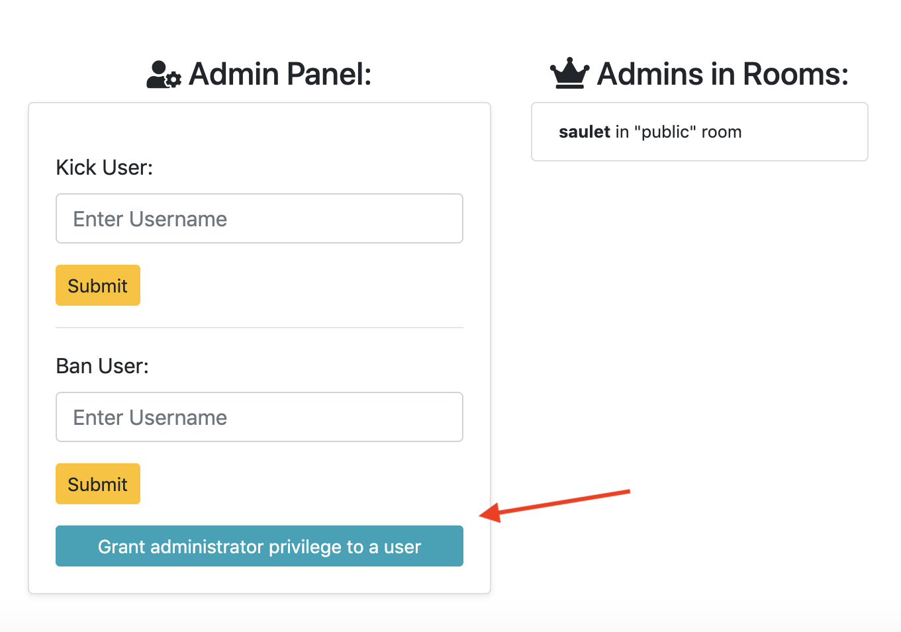
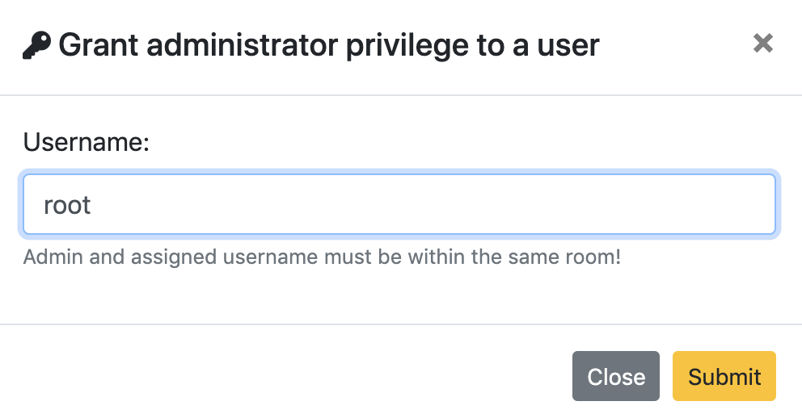
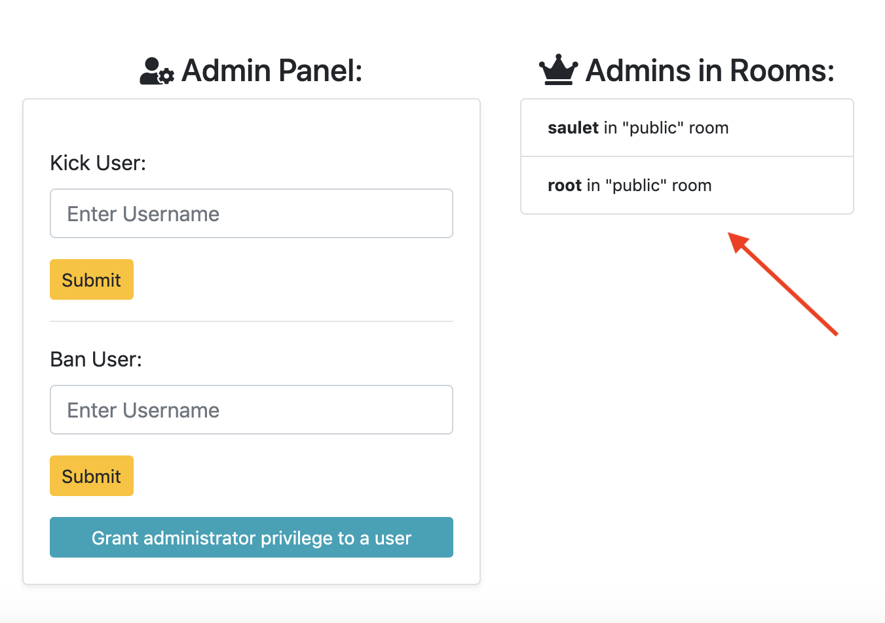

# CSE330
467511
466311

## Module 6: Multi-Room Chat Server

## Usage:

Navigate to folder. Download project dependencies by simply running command:
```
npm install
```

After that, run web server using node by running command:

```
node server.js
```

Launch favorite browser (Google Chrome or Mozilla Firefox), and go to:

```
http://localhost:3000/
```

## Creative Portions: Give Administrator Privilege to Other Users and Display Admins in Rooms

Whenever you create room (with or without password), you become an administrator that gives you privilege to kick or ban other users. However, what if you leave a room and there is a spammer user. Therefore, it would be beneficial to give administrator privilege to other users. If you a creator of the room, click to button "Grant administrator privilege to a user" that pops up a modal.

<p style="text-align: center;">
    
</p>

In the modal, enter assigned username *(Note: assigned username and admin must be in same room)*

<p style="text-align: center;">
    
</p>

After that, you could see assigned username as admin in the room.

<p style="text-align: center;">
    
</p>

### Authors
* Saulet Yskak
* Zhongrui Wang

